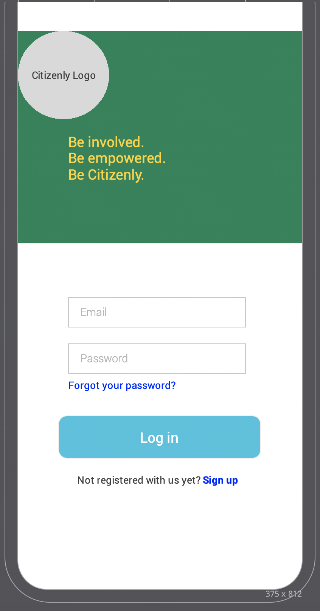
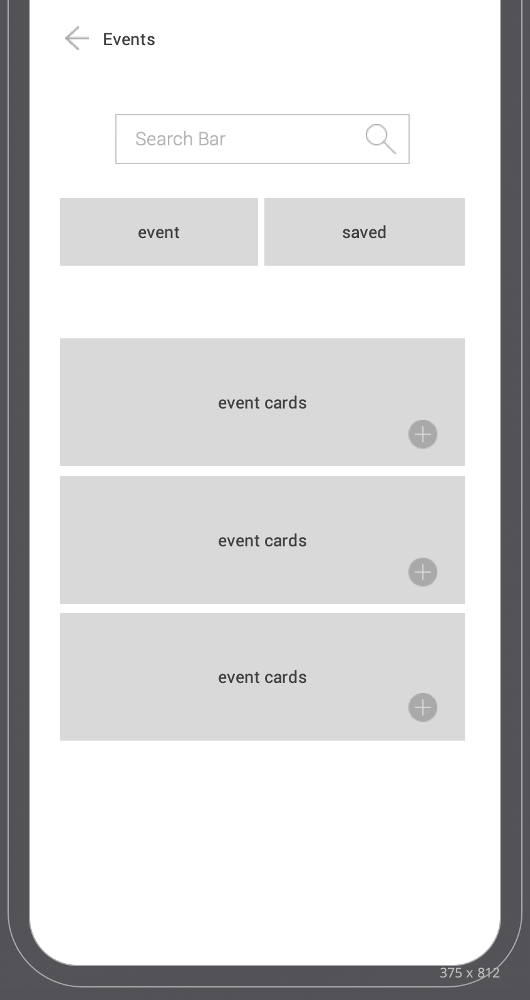
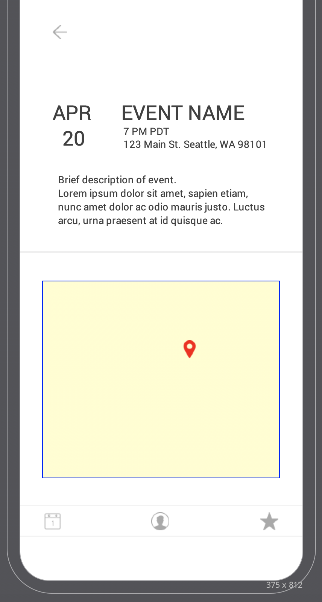

# ga-wdi23-project-3

General Assembly Web Development Immersive Project 3

Carlo Bruno
Garrett M
Charles Yun
Hannah Erickson 

# Citizenly React Front-end
- [Initial Planning](#initial-planning)
- [User Stories](#user-stories)
- [Technologies](3technologies)
- [Styling/UX](#styling-and-ux)
- [Data/APIs](#data-and-apis)
- [WireFraming/Planning/Pages/Components](#wireframing-planning-pages-and-components)
- [Roadblocks](#roadblocks-along-the-way)
- [Further Development](#stretch-goal-and-further-development)
- [Special Thanks](#special-thanks-to)


## Initial Planning

We spent the initial phases attacking project ideas and user stories. We brainstormed a lot and 
wanted all participants on the same page about our efforts so that we all feel motivated and 
excited to execute this project. 
We all agreed we wanted to help a user better understand a specific topic through transparency and organization. 
We centered in on how to help inexperienced citizen become more active in local politics. 
We will be including MapBox to make attending easy and accessible. We want to give the user 
all the resources to do their own research and participate within their area. 

### User Stories:

“I want to get into local politics but I don’t know where to begin. “

“I like following politics but there are so many biased, how to I get fact based, 
politically driven data “

I know who our higher policatical leaders are, but don't ask me about my city elected officials 
and representatives.

“I want to be able to plan and know whats going on around me when it comes to local elections 
and representatives”

“I want to know more basic information about local politicians, like straight access to their 
social media, voting  history and up coming policies/votes.”

"As a user, I want to be able to save local events to my account to reference them 
later inorder to attend."

"As a user, a map with location and directions would make my experience 
easier and I would be more likely to go to an event on the fly"

Additionally, although this app is catered to a person who is taking the initiative to get more involved in local   
politics, but we also wanted a user to skip the full profile and also be able to search for local information based   
solely on their  zip code. So User profiles are optional but will create a better user experience but an  
un-invested user will be able to see local events and upcoming elections as well. 

## Technologies Used:

Express
Mongoose
Express JWT
RateLimit
Axios
React Router
Upload
Font Awesome
Bcryct
Helmet
Axio
JSON WebToken
Cloudinary
Cloudinary Storage
Multer
Moment JS
Mapbox
dotenv

## Styling and UX:

Since this app was ultimately created to encourage users to get involved with <br />
political events (more than not   surrounded with descriptions like 'boring', 'pointless', 
and disorganzied'), we focused on simplicity, readability  and direct to source links. 
We also wanted to focus on the app being used by any individual, not just someone interested 
specifically in politics and chose green as a welcoming but un-affiliated color regarding politics. <br />
Creating one's own profile to upload a photo, change locations is needed, 
and being able to save events to their page was going to be the major functionality of our app. <br />
We added political resources and elected officals as additional resources 
to encourage research and fact-checking throughout the local political process. 

## Data and APIs

After looking through API’s we concluded that a national scope is too broad for local government via the data we found. <br />
We decided to focus on just Washington state local government and found some great resources on local community and government events. We are hoping to be able to pull from the same API,depending on how we can query endpoints but decided to shift our vision to be event oriented and take from two Gov.data API as well as a MeetUP Api that can be selected specifically for political events. 
Becuase there was a lack of API's for local representatives on the city and county levels, 
we hardcoded our own data researched online, ultimately creating another small API that can be updated as needed. 
We created functions for each so that we could compile and do an axiosAll call. 
We also added Moment for more user readability while referencing dates. 

### Our APIs:

Meetup API
'https://api.meetup.com/2/concierge?&sign=true&photo-host=public&zip=98102&category_id=13' <br />
    
Community Outreach Events
'https://data.seattle.gov/resource/OutreachEventCalendar.json' <br />
    
City Council Events Calendar
'https://data.seattle.gov/resource/mjjw-fp32.json' <br />

We used all through Apis by making them all fit into the same object form with 
keys values we needed; event Name, venue, street address, event url, latitude/longitude and 
event description. We then simply concatenated the three apis into one array to be able to 
access all the data at once. We focused on sorting the data by date to have more user readability. <br />
Additionally, we added the search bar for non-users to search events by zipcode. 

Users can save events to your SAVED EVENTS on their profile and are stored in the db. Ideally, 
we would like to save favorited or local representatives as well as the links to Elections. 

## WireFraming, Planning and Pages & Components

We decided on the name Citizenly and built wire frames around a green theme with icons. 
Here are some of our notes on appearence, tables, notes and the planning of pages and 
components for the app. 
Although, slight style changes were made along the way, we generally stuck to a simple 
pattern as we didnt ever want to overwhelm an user. 
Our components stored our states as that would hold data that was 
editable and/or changed with our API data. 


<br />
 |
 |


```bash
App (Class
│
├─ Pages
│  ├─ LandingPage
│  │
│  ├─ Profile
│  │  ├─ Signup (Class)
│  │  └─ UpdateProfile
│  │
│  ├─ Events (Class)
│  │  └─ EventShow
│  │
│  ├─ InOffice
│  │  
│  │
│  └─ Elections
|  |_ Officals
│
└─  Components
   ├─ Header
   ├─ MenuBar
   │
   ├─ EventCard
   ├─ OfficeCard
   │
   ├─ Mapbox
   │
   ├─ Login (Class)

   ├─ Loading
   └─ LoadingWhite
```
## Roadblocks Along the way:

Although, overall our planning and app was hiccup-free, wedid have some challenges to work through. 
First was the APIs or lack there of as far as  thespecific data we wanted to use. We ended up hard-coding 
representative information and selecting MeetUp apis tohelp fill the gaps of our governement APIs that left muchto be desired. 
Although routing including re-factoriing a few times, itwas not    
overwhelming.
Mapbox and Cloudinary which group members had worked within the past,  unfortunately worked very differently in aReact app and resulted in    learning a whole new way towork with those dependencies -props to Garrett  forre-learning about both and reframing Axios calls to getthem up and running. 
Lastly, deploying on Heroku became impossible while usingour Mapbox access token. 
While we realized it was a envirmoental issue and not anissue with  the functionality of the app, 
it was very frustrating. ** We were able to share our token with URL limitations which eventually would allow us to deploy, however, MapBox's token situation is a bich.  


## Stretch Goal and Further Development:

Notifications to notify users about upcoming, saved events
User to User connectivity and chatting to plan to go toevents together
Delete Saved events 
Loading Icons while data is created
Api's for local representatives and/or more events
State to National application and use
User social media and DOB for more targeted sharing 

### Special thanks to:
The team! <br />
Git Masta <br />
Dev Docs <br />
Salt-N-Pepa <br />
Unsplash <br />
Trello <br />
Mike/Steve <br />

#### NO THX TO MAPBOX (only kinda)